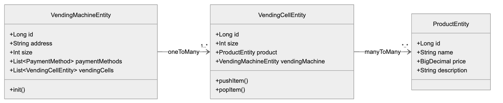

# Общая архитектура

## Слой контроллеров (Controller)

- REST API для управления всей системой.
- Принимает запросы от клиентов, формирует или валидирует входные данные, вызывает нужные сервисы и
  формирует HTTP-ответ.

#### `VendingMachineController`

- REST-эндпоинты для работы с вендингом и с ячейками этого вендинга

#### `ProductController`

- REST-эндпоинты для управления товарами: создание, редактирование, удаление продукта, получение
  списка товаров.

#### `OrderController`

- REST-эндпоинты для создания заказа, отображения информации по заказу, добавления/редактирования
  позиций заказа (заказных товаров).

#### `PaymentController`

- REST-эндпоинты для проведения оплаты, получения статуса оплаты, фиксации результата при оплате
  через разные каналы (APP, терминал, наличные).

#### `LogsController`

- REST-эндпоинты для работы с логами

## Слой сервисов (Service)

- Содержит бизнес-логику работы: управление вендинговыми аппаратами, формирование заказов,
  проведение оплаты, выдача товаров, работа с журналом логов и др.
- Осуществляет транзакции (при необходимости), проверяет условия бизнес-логики (например, достаточно
  ли места в ячейках, доступность товаров и пр.), обращается к репозиториям.

#### `VendingMachineService`

- Управление вендинговыми аппаратами: добавление/редактирование/удаление автомата, актуализация
  списка доступных способов оплаты, получение списка и информации об автоматах.
- Взаимодействие с хранилищем (репозиторием) вендинговых автоматов.

#### `VendingCellService`

- Управление ячейками конкретного автомата: проверка и изменение остатков товара в ячейках, проверка
  корректности заполнения ячеек, обновление информации о текущем количестве, продукте и т. д.
- Взаимодействие с репозиторием ячеек.

#### `ProductService`

- Управление товарной номенклатурой: добавление/обновление/удаление товаров, поиск товаров, загрузка
  списка/карточки товара.
- Контроль корректности связей ячеек/товаров (проверка, что товар существует).

#### `OrderService`

- Формирование заказов (добавление в заказ необходимых OrderItem), проверка доступности товаров в
  ячейках, обработка статусов заказа: создан, оплачен, выполнен.
- Актуализация остатков (уменьшение количества товара в соответствующих ячейках при подтверждении
  покупки).
- Взаимодействие с репозиторием заказов и позиций заказа.

#### `PaymentService`

- Обработка платежей: определение суммы к оплате, инициация платежа, фиксация успешного или
  неуспешного платежа.
- Управление процессом оплаты в системе (APP, TERMINAL, CASH).
- Запись информации об оплатах в репозиторий.

## Слой репозиториев (Repository)

- Работает с базой данных, выполняет CRUD-операции.

## Слой моделей (Entity/Model)

- Содержит описания сущностей: VendingMachine, VendingCell, Product, Order, Payment, LogRecord
- Каждая сущность отражает таблицу или структуру хранения данных в БД.

# Краткое описание основных сущностей

### `VendingMachine(VM) <-> VendingCell(VC) <-> Product(P)`

#### `VendingMachine`

Описывает вендинговый аппарат (cодержит набор ячеек `VendingCell`):

- `id`
- `address`
- `size`
- `paymentMethods` (массив `PaymentMethod`)
- `vendingCells` (массив `VendingCellEntity`)

#### `VendingCell`

Ячейка внутри автомата:

- `id`
- `size`
- `product` (ссылка на товары)
- `vendingMachine` (ссылка на `VendingMachine`)

#### `Product`

Данные о товаре:

- `id`
- `name`
- `price`
- `description`

#### `Order`

Заказ/покупка:

- `id`
- `vendingMachine`
- `createdAt`
- `paid`
- `completed`
- Список позиций заказа (`OrderItem`).

#### `OrderItem`

Позиция заказа (определяет, из какой ячейки (`VendingCell`) и сколько товара выдать) :

- `id`
- `order` (ссылка на заказ)
- `cell` (ссылка на ячейку)
- `quantity`
-

#### `PaymentMethod` (enum)

Перечисление доступных способов оплаты:

- `APP`
- `TERMINAL`
- `CASH`
-

#### `Payment`

Информация об оплате:

- `id`
- `order` (ссылка на заказ)
- `amount`
- `paymentMethod` (тип `PaymentMethod`)
- `paidAt`

#### `LogRecord`

Журнал событий:

- `id`
- `operation`
- `message`
- `timestamp`
